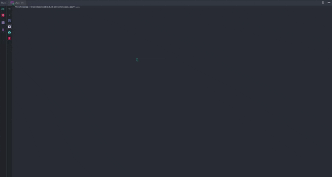

# Cellular-Automaton
Elementary cellular automaton after Stephen Wolframs specifications.

# Rule 90:
Currently the CA is restricted to only one dimension and only using the command prompt
to display "#" or "-" depending on state (0 or 1). The only rule implemented so far is Rule 90

Rule set: 000 = 0; 001 = 1; 010 = 0; 011 = 1; 100 = 1; 101 = 0; 110 = 1; 111 = 0;

# Demo:

As said above, there isn't much to show yet.
The following demo shows a CA using rule 90 for a few generations.
